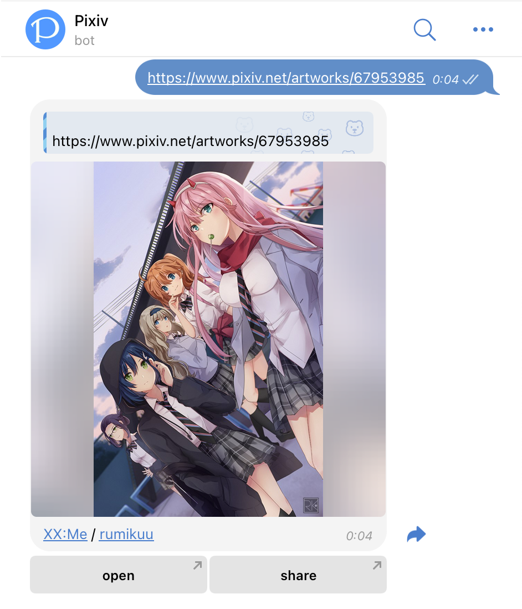
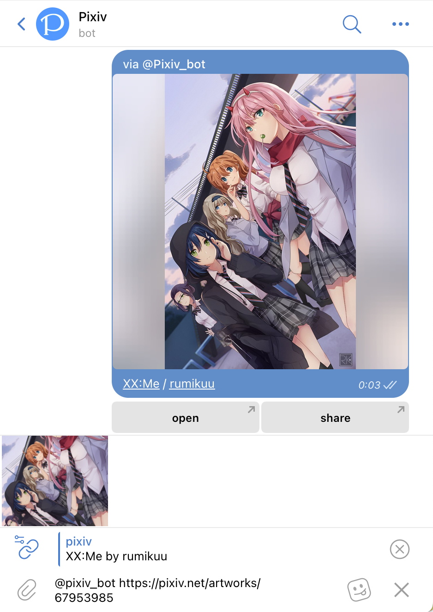
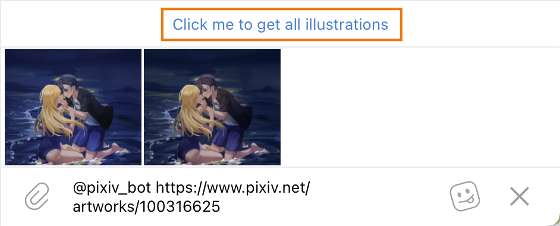

# Pixiv bot

Telegram で Pixiv の作品を送信するための Bot です。

[Bot を開始](tg://resolve?domain=pixiv_bot&start=67953985) | [グループに追加](tg://resolve?domain=Pixiv_bot&startgroup=s)

## クイックスタート

### メッセージモード



Bot は次の形式のリンクや ID を検出すると返信します。

- pixiv.net/artworks/:id
- pixiv.net/artworks/en/:id
- pixiv.net/i/:id
- pixiv.net/member_illust.php?illust_id=:id
- pixiv.net/member_illust.php?illust_id=:id#manga
- :id（数字のみ）

1 件のメッセージに複数の URL を含めることもできます。

### インラインモード

共有ボタンを押すか、任意のチャットで [@pixiv_bot](https://t.me/Pixiv_bot) と入力すると、Bot のチャットへ移動せずに利用できます。



複数ページ作品、未変換のうごイラ、または `+spoiler` を使用する場合は、通常のメッセージモードへ切り替える案内が表示されます。



検索機能は Pixiv Premium が必要なため、現在は実装を保留しています。

## 設定

作品 URL と一緒に `+tags` を付けるとタグを表示し、`-open` を付けると「開く」ボタンを非表示にできます。

永続設定は `/s` コマンドで保存します。

```text
/s +tags -share
```

グループやチャンネルの設定をメンバー全員に適用するには `/s +overwrite` を使います。その会話で一度だけ個人設定を使う場合は作品 URL に `+god` を加えてください。`+god` は永続保存できません。

### オプション一覧

| オプション | 別名 | 内容 | 制限・補足 |
| --- | --- | --- | --- |
| `+tags` / `-tags` | `tag` | タグを表示／非表示 | 特殊文字を含むタグはリンクにならない場合があります。 |
| `+desc` / `-desc` | `description` | 説明を表示／非表示 | |
| `+id` / `-id` | `show_id` | 作品 ID を表示／非表示 | 既定の形式に `%id%` は含まれません。 |
| `+rm` / `-rm` | | 画像のみを表示／解除 | ボタンとキャプションを表示しません。 |
| `+kb` / `-kb` | `keyboard`, `remove_keyboard` | ボタンを表示／削除 | |
| `+cp` / `-cp` | `remove_caption` | キャプションを表示／削除 | |
| `+open` / `-open` | | 「開く」ボタンを表示／削除 | |
| `+share` / `-share` | | 「共有」ボタンを表示／削除 | チャンネルでは強制的に無効になります。 |
| `+sc` / `-sc` | `single_caption` | 複数画像でキャプションを 1 件だけ表示／解除 | インラインモードでは利用できません。 |
| `+above` / `-above` | `caption_above` | 画像の上にキャプションを表示／解除 | |
| `+reverse` / `-reverse` | | 作品を逆順で送信／解除 | 作品内のページ順は変わりません。 |
| `+file` / `-file` | `asfile` | ファイルとして送信／解除 | インラインモードでは利用できません。 |
| `+af` / `-af` | `append_file` | 元ファイルを追加／解除 | インラインモードでは利用できません。 |
| `+graph` / `-graph` | `telegraph` | Telegraph ページを作成／解除 | インラインモードでは利用できません。 |
| `+album` / `-album` | | MediaGroup を使用／不使用 | インラインモードでは利用できません。 |
| `+one` / `-one` | `album_one` | 全作品を 1 つの MediaGroup にまとめる／解除 | |
| `+equal` / `-equal` | `album_equal` | MediaGroup の枚数を均等に分割／解除 | 14 枚なら 7+7 に分割します。 |
| `+sp` / `-sp` | `spoiler` | スポイラーを付ける／解除 | インラインモードでは利用できません。 |
| `+caption` / `-caption` | `caption_extraction` | キャプションから関連作品を抽出／解除 | 特別な用途向けです。 |
| `+overwrite` / `-overwrite` | | グループ設定による上書き／解除 | インラインモードでは利用できません。 |
| `+god` | | 一度だけ個人設定を使用 | 保存できず、インラインモードでも利用できません。 |

### MediaGroup の詳細

`+album` は既定で有効です。複数ページ作品は MediaGroup にまとめられますが、Telegram の上限は 1 グループ 10 枚のため、画像が多い場合は分割されます。20 枚を超える場合は `+graph` の利用をおすすめします。


- `+one`：複数作品を 1 つの MediaGroup にまとめます。
- `+equal`：16 枚を 8+8 のように、各 MediaGroup の枚数を均等にします。
- `+sc`：MediaGroup に作品名とページ数のキャプションを表示します。

### Telegraph の情報

`+telegraph` と同じメッセージで、改行区切りの `title=...`、`author_name=...`、`author_url=...` を指定できます。

Telegram Instant View を利用するため、取得に失敗する場合があります。一度に扱う画像は 200 枚未満をおすすめします。telegra.ph をブラウザーで直接開くと IP アドレスが収集される場合があるため、詳しくはプライバシーポリシーを確認してください。

```text
https://www.pixiv.net/artworks/91105889 +telegraph
title=白スクのやつ
author_name=syokuyou-mogura
author_url=https://www.pixiv.net/users/579672
```

## 作品の著作権

このページでは次の作品を使用しています。

- [「見つけた」](https://www.pixiv.net/artworks/100316625)
- [XX:Me](https://www.pixiv.net/artworks/67953985)
- [白スクのやつ](https://www.pixiv.net/artworks/91105889)
