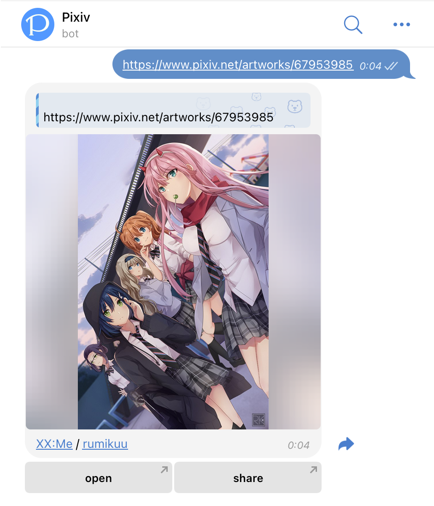
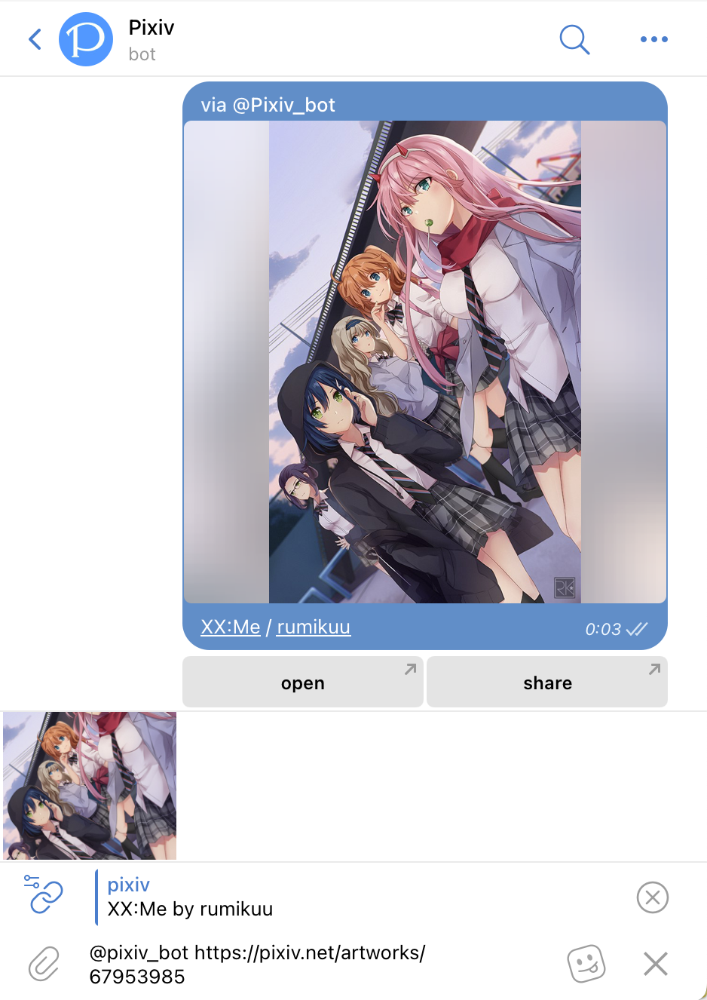
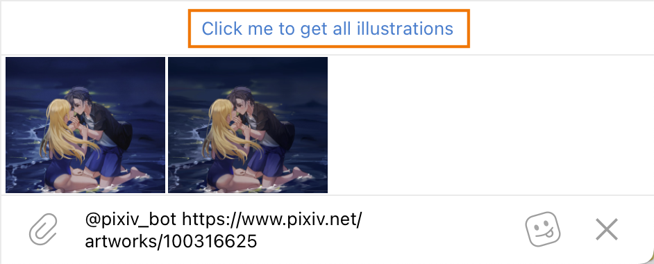
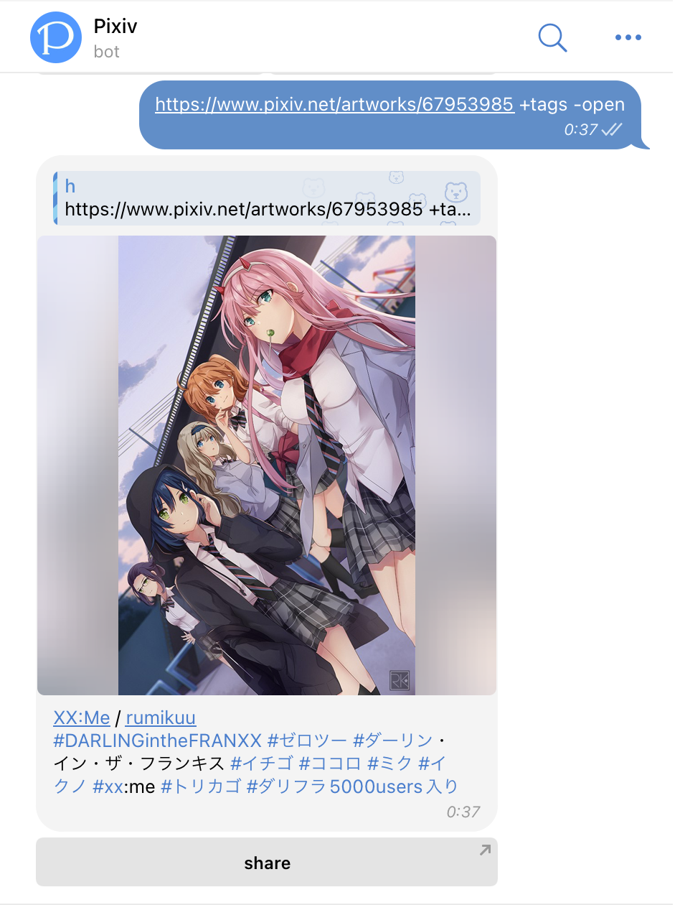

# Pixiv bot

A Telegram bot that helps you send artwork from Pixiv on Telegram.

[Click to start](tg://resolve?domain=pixiv_bot&start=67953985) | [Add bot to group](tg://resolve?domain=Pixiv_bot&startgroup=s)

## Quick Start

### Message Mode



The bot will respond when it detects the following links:

- pixiv.net/artworks/:id
- pixiv.net/artworks/en/:id
- pixiv.net/i/:id
- pixiv.net/member_illust.php?illust_id=:id
- pixiv.net/member_illust.php?illust_id=:id#manga
- :id (pure numbers)

You can include multiple links in one message and send them all to the bot at once!

### Inline Mode

The bot supports Telegram inline mode, allowing you to use the bot without switching to the bot's chat window.

Click the share button or type [@pixiv_bot](https://t.me/Pixiv_bot) to trigger the bot.

> Just type `@pixiv_bot` will be work, it's case insensitive.



Additionally, inline mode currently requires switching to normal message mode in the following cases:

- artworks containing multiple images (multi-page)
- Using the `+spoiler`
- ugoira that have not been convert yet

> When you need to switch to normal mode, you will see a prompt like the image above:  
>   
> Click to switch to normal message mode or use the inline results just needed.

> Additionally, the search function is not yet implemented (requires Pixiv Premium), so it is on hold.

## Advanced Usage

The bot supports some custom configurations. Here are the configuration instructions.

Custom configuration is very simple. You just need to input some keywords along with the artwork link:
For example, `+tags` will include tags in the output.  
If you don't want the open button, input `-open` to remove the button:  



### `/s` Persist Configuration

For some parameters, like `+tags`, you might want to save them persistently. This is also very simple.
For example:

```
/s +tags -share
```

After successfully saving, the bot will output artworks with the `+tags` and `-share` configuration by default.

This feature is also applicable in groups, with options to adjust priorities to unify the format in the group. Refer to the next section for specific configurations.

### `+overwrite` Use Group Settings Instead of Personal Settings in Groups

If you want all members in the group/channel to use a uniform format, you can use:

```
/s +overwrite
```

to make all group members use the group configuration.

If you want to output your own format in the group on a single occasion, just include `+god` when sending the message.

> `+god` is not a persistent configuration, please include it every time you use it.

### Custom Message Format
TODO (Refer to the configuration page)

## cheatsheet

| name        | alias                        | description                                           | remark                                                                                                       |
| ----------- | ---------------------------- | ----------------------------------------------------- | ------------------------------------------------------------------------------------------------------------ |
| -+tag       | tags                         | Show artwork tags                                     | artwork tags may not be recognized as clickable links if they contain special characters (e.g., 《》() - ・) |
| -+desc      | description                  | Show artwork description                              |                                                                                                              |
| +-id        | show_id                      | Show artwork ID                                       | Default display format does not include %id% field, please implement through custom message format           |
| -+rm        |                              | Show only images                                      | Do not show buttons and caption                                                                              |
| +-kb        | keyboard <br>remove_keyboard | Show or remove buttons                                |                                                                                                              |
| +-cp        | remove_caption               | Show or remove captions                               |                                                                                                              |
| +-open      |                              | Show or remove open button                            |                                                                                                              |
| +-share     |                              | Show or remove share button                           | Forced on in inline mode that switched to mesaage mode<br>Forced off in channel                              |
| -+sc        | single_caption               | Show only one caption when sending multiple images    | Cannot be used in inline mode                                                                                |
| -+above     | caption_above                | Show caption above the image                          |                                                                                                              |
| -+reverse   |                              | Send artworks in reverse order                        | Does not change the order of pages within a artwork                                                          |
| -+file      | asfile                       | Send as file                                          | Cannot be used in inline mode                                                                                |
| -+af        | append_file                  | Send images in addition to the artwork                | Cannot be used in inline mode                                                                                |
| -+graph     | telegraph                    | Convert to Telegraph                                  | Cannot be used in inline mode                                                                                |
| +-album     |                              | Send artworks as MediaGroup                           | Cannot be used in inline mode                                                                                |
| -+one       | album_one                    | Send all artworks as one MediaGroup                   | For example, if you send 2 artworks, the bot will send them as one MediaGroup instead of separately          |
| -+equal     | album_equal                  | Try to send MediaGroup artworks in balanced parts     | For example, if there are 14 images, it will be split into 7+7 instead of 10+4                               |
| -+sp        | spoiler                      | Mark images as hidden (sensitive content)             | Cannot be used in inline mode                                                                                |
| -+caption   | caption_extraction           | Extract and send related artworks from image captions | Special requirement, not needed by default                                                                   |
| +-overwrite |                              | Override user settings in groups or channels          | Cannot be used in inline mode<br>Using inline mode in groups will not trigger overwrite behavior             |
| +god        |                              | Use own format in groups/channels with `+overwrite`   | Cannot be used in inline mode<br>Cannot persist with `/s +god`                                               |

### `+album` mediagroup Series

The bot supports merging multi-page artworks into one mediagroup. MediaGroup is a feature in Telegram that allows displaying multiple media in one message.

Thus, the `+album` parameter is enabled by default. If a artwork has multiple pages, all images will be packed into one mediagroup.  
Additionally, Telegram limits a mediagroup to 10 images, so in cases with many images, they will still be sent separately but as mediagroups.  
For cases with more than 20 images, it is recommended to use the `+graph` parameter below to convert the artworks into a Telegram page for instant preview.  

::: details Curious? Click here to see the magic of the mediagroup series in action!
  
:::

#### `+one`

If there are multiple artworks, they will all be merged into one mediagroup.

#### `+equal`

When the bot sends more than 10 images at a time, it will try to balance the number of images in each mediagroup. For example, if there are 16 images, they will be sent in 2 groups of 8 each.

#### `+sc`

Show caption in the mediagroup  
This feature allows you to see what is being sent directly, with the format showing only the artwork name and the number of pages. You can still customize this format.

### `+graph` `+telegraph` Convert artworks into a Telegraph page

Input `+graph` / `+telegraph` in the message, and the bot will compile multiple artworks into a Telegraph page.  
It will return a Telegraph link for quick preview on mobile.

> This is part of the Telegram Instant View service, and there may be scraping failures. It is recommended to keep the number of images below 200.

> This part uses a webp conversion server. Directly visiting the telegra.ph page may collect your IP. For more details, please refer to our privacy policy.

#### Customizing title, author name, and author link in the `telegraph` link

For example:

```
https://www.pixiv.net/artworks/91105889 +telegraph
title=White Swimsuit
author_name=syokuyou-mogura
author_url=https://www.pixiv.net/users/579672
```

The content after the `=` will be matched, separated by line breaks.


# artwork Copyright
Materials on this page are sourced from:  
- [「見つけた」](https://www.pixiv.net/en/artworks/100316625)  
- [XX:Me](https://www.pixiv.net/en/artworks/67953985)
- [白スクのやつ](https://www.pixiv.net/en/artworks/91105889)

Hoping to one day have the budget and opportunity to travel to `Wakayama City, Japan`  
(⁠ﾉﾟ⁠0ﾟ⁠)⁠ﾉ⁠~