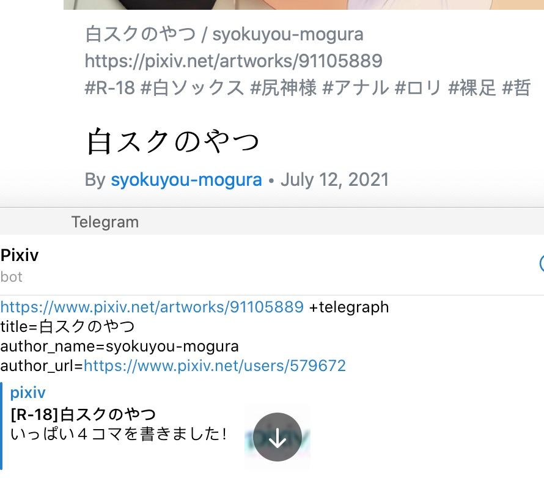

<!-- translate by deepl -->
# Pixiv bot
A Telegram bot that helps you send pixiv illust on telegeam.  
[Get started!](tg://resolve?domain=pixiv_bot&start=67953985) | [Add me to a group](tg://resolve?domain=Pixiv_bot&startgroup=s)  

 
  


The following Pixiv links are currently supported:
- pixiv.net/artworks/:id
- pixiv.net/artworks/en/:id
- pixiv.net/i/:id
- pixiv.net/member_illust.php?illust_id=:id
- pixiv.net/member_illust.php?illust_id=:id#manga
- :id （就是純數字）
## Simple usage
### message mode
Just send pixiv link to bot  
Supports multiple links in one message, just send them all to me!

### inline mode
bot supports Telegram's inline mode, click the share button or [@Pixiv_bot](https://t.me/Pixiv_bot) in the chat to experience it.  
At the moment, inline only has the function of daily ranking and illust id, there is no search function yet.


## Advanced Usage
The bot supports some custom usage, here is the introduction of usage.  
For example, if I want to show the tag of my work in the reply, then I type `+tag` and it will be shown.  
If I don't want the open button, then I type `-open` and the open button disappears.  
### persistent save configuration
Use `/s` followed by the configuration  
For example:  
```
/s +tags -share
```
Then bot will default to the `+tags` `-share` configuration for the message / inline  

#### gives priority to group customization in groups +overwrite
```
/s +overwrite
```
To overwrite user's customization (for group)

If you still want to export your own formatted links in the group, send illust's links with `+god`.
### Include work tags +tags
Just type `+tag` / `+tags` in the message to show the tags of your work.  
> Due to Telegram's limitation, the work tags will not become clickable links when some special characters are encountered (e.g. `() - ・)), which means I can't fix it.   

### Exporting works in reverse order +desc
The exported work will be in the reverse order of the input links (multip does not affect)  
Example:  
Input:  
- illust 1 link
- illust 2 link

Return:  
- illust 2's image 1
- illust 1's image 1
- illust 1's image 2

### Show series on demand -open -share -kb -cp -rm
One image summarizes.
! [r_2](. /img/r_2.jpg)  
Description.  
- `-open` does not show the open button
- `-share` does not show the share button
- `-kb` Both open and share buttons are not displayed
> kb = keyboard
- `-cp` does not show the text in the picture
- `-rm` Show only the picture

set to default (/s -open ...) You can still manually add `+open` or something like that to the end of the work to display the corresponding content
### Sending work as a file +file

Enter `+file` and the bot will send you the source file directly.  
> and `/s +file` then the work sent to the bot will be sent directly to you every time  

### Integrate multiple artworks into one media group (album) +album (enabled by default)

Enter `+album` in the message and the bot will integrate multiple entries into one media group  
If you need to disable this feature and send once to an id, then enter `-album` and you're done  
> The order of sending pictures may change after `-album` is turned on, and the multi-p works will still be in the media group.  
> Also, Telegram has a limit of 10 images in a media group, so it will still send them in separate groups.

### Use telegraph to display +graph +telegraph for multiple entries

Type `+graph` / `+telegraph` in the message and the bot will integrate multiple entries into one telegraph and return a telegraph link for a quick preview on your phone.

> If there are too many graphs, Telegram may not show IV instant previews, it is recommended to have less than 200 at a time.  
#### Customize the title, author name and author link in the telegraph link
Example:  

```
https://www.pixiv.net/artworks/91105889 +telegraph
title=白スクのやつ
author_name=syokuyou-mogura
author_url=https://www.pixiv.net/users/579672
```

  


