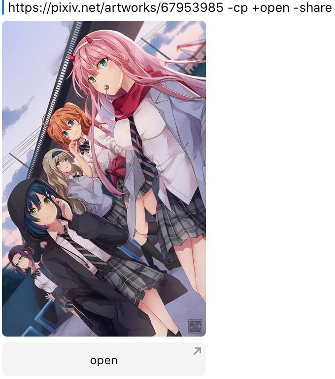

# Pixiv bot
一個 Telegram 機器人，可以幫助您在 Telegram 發送來自 Pixiv 的作品。  
[點我開始體驗](tg://resolve?domain=pixiv_bot&start=67953985) | [把 bot 添加至群組](tg://resolve?domain=Pixiv_bot&startgroup=s)  

 
  


當匹配到以下 Pixiv 連結後 bot 會回復。
- pixiv.net/artworks/:id
- pixiv.net/artworks/en/:id
- pixiv.net/i/:id
- pixiv.net/member_illust.php?illust_id=:id
- pixiv.net/member_illust.php?illust_id=:id#manga
- :id （就是純數字）

## 簡單用法
### 普通消息模式
僅需發送 pixiv 的連結給 bot 即可  
支持一個消息裡面包含多個連結，無腦地全部發送給 bot 就行！

### inline 模式
bot 支持 Telegram inline 用法，點擊 share 按鈕或者在聊天窗口 [@Pixiv_bot](https://t.me/Pixiv_bot) 即可體驗～  
目前 inline 只有每日榜圖以及查找 id 的功能，暫時還沒有直接搜索作品功能

> 這個需要填坑！(會員帳號才能有熱門排序 暫時擱置了)

## 進階用法
機器人支持一些自訂配置，下面是配置說明
簡單地來說，自訂配置就是在發送作品的時候再多打幾個字傳參數，例如我想在回復裡面顯示作品的標籤，那麼輸入 `+tag` 就會顯示了
如果不想要打開 (open) 按鈕，那麼輸入 `-open` 打開按鈕就消失了

### 持久化保存配置
（本來是應該做成網頁版的，不過網頁版還沒補坑）
使用 `/s` 後面接配置
例如:  
```
/s +tags -share
```
那麼後面 bot 就會默認以 `+tags` `-share` 的格式輸出作品
設置成 自訂配置（如 /s -open -kb ...) 後 仍然可以在 連結 / id 後面手動加上 `+open` `+kb` 等來顯示對應的內容

#### 在群組中優先使用群組自訂結果 +overwrite
```
/s +overwrite
```
即可覆蓋個人自訂結果（群組用）

如果單次在群組裡面想輸出自己格式的消息，那麼每次發送的時候帶上 `+god` 即可
> 持久化配置 請使用 `/s -overwrite`
> 而不是 `/s +god` ！

### 按需顯示系列
一張圖概括:  
  
說明:  
- `open` 控制是否顯示 open 按鈕
- `share` 控制是否顯示 share 按鈕
- `kb` 同時控制 open 和 share 按鈕
> kb = keyboard
- `cp` `rm` 控制是否添加圖片的描述
> `+sc` 多張圖片只為第一張圖片增加描述
- `+above` show_caption_above_media
例如:  
- `+open -share` 顯示 open 按鈕 不顯示 share 按鈕

### 支持讀取 caption 中的連結 +caption
`+caption` bot 就能讀取消息 caption 中的 Pixiv 作品連結

### 包含作品標籤 +tags
僅需在消息中輸入 `+tag` / `+tags` 即可顯示作品的標籤
> 由於 Telegram 的限制，作品標籤在遇到一些特殊字元的時候（比如 《》（） - ・ ）是不會識別為可以點擊的連結的，這個我沒有辦法解決。

### 給圖片加上遮罩 +sp
輸入 `+sp` bot 就會給發送的圖片增加 spoiler 效果
> 由於 Telegram 問題 inline 下仍不能使用

### 使用文件形式發送作品 +file
輸入 `+file` ，bot 就會直接發送原圖文件給你。
> 以及 `/s +file` 那麼 bot 每次都是直接發送原圖文件給你
> 適合收藏原圖的小伙伴（網頁右鍵下載還更快？）

輸入 `+af` `+appendf` ，bot 會發送完圖片後再發送原圖文件給你
> 同時支持持久化配置

### 倒序輸出作品 +desc
輸出的作品會和輸入連結順序相反（多p不影響）
例如:  
輸入:  
- illust 1 link
- illust 2 link

返回:  
- illust 2's image 1
- illust 1's image 1
- illust 1's image 2

### 將多個作品集成到一個媒體組（相冊）裡面 +album / +one（預設啟用）
在消息中輸入 `+album` / `+one` 機器人就會將多個作品集成到一個 mediagroup 中  
如果需要關閉這個功能 一個 id 發送一次 那麼輸入 `-album` 即可
> `-album` 後發圖順序可能有點變化，並且多p作品還是會在媒體組裡面

另外 Telegram 有限制 一個 mediagroup 最多只能有 10 張圖，所以還是會分p發送
> `+equal` 當 bot 一次發送超過10張圖的時候會嘗試均衡 mediagroup 裡面的數量，比如說有 16 張圖片，會分 2 次每次發送 8 張

### 將多個作品使用 telegraph 顯示 +graph +telegraph
在消息中輸入 `+graph` / `+telegraph` 機器人就會將多個作品集成到一個 telegraph 中，並且返回一個 telegraph 連結，手機可以快速預覽。

> 圖太多的話 Telegram 可能不會出現消息即時預覽，建議一次低於 200 張。
~~太多了我馬鈴薯伺服器也許會當機 qaq~~
#### 在 telegraph 連結中自訂標題、作者名字以及作者連結
例如：

```
https://www.pixiv.net/artworks/91105889 +telegraph
title=白スクのやつ
author_name=syokuyou-mogura
author_url=https://www.pixiv.net/users/579672
```
格式，=號後面的內容全部都會被匹配到，以換行作為分割


