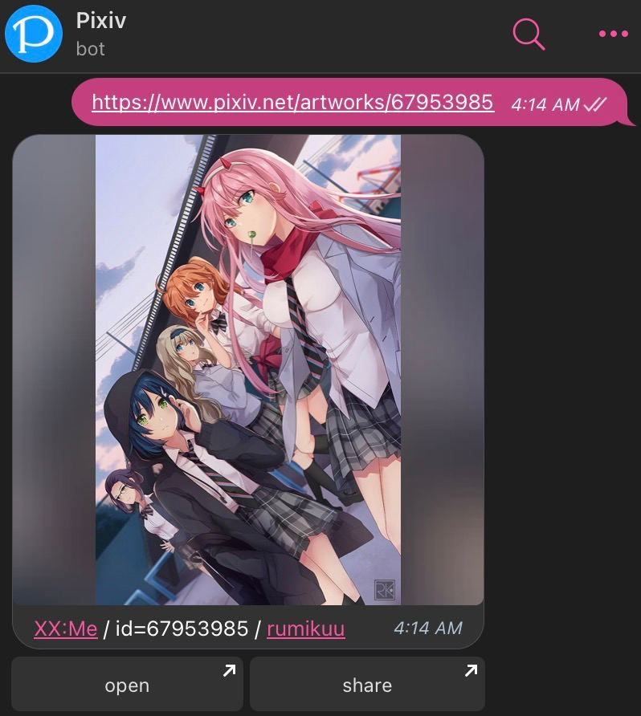

# Pixiv bot
一個 Telegram 機器人，可以幫助您在 Telegram 發送來自 pixiv 的作品。  
[點我開始體驗](tg://resolve?domain=pixiv_bot&start=67953985)  

  

當匹配到以下 Pixiv 連結後 bot 會回復。
- pixiv.net/artworks/:id
- pixiv.net/artworks/en/:id
- pixiv.net/i/:id
- pixiv.net/member_illust.php?illust_id=:id
- pixiv.net/member_illust.php?illust_id=:id#manga
- :id （就是純數字）
## 簡單用法
### 普通消息模式
僅需發送 pixiv 的連結給 bot 即可  
支持一個消息裡面包含多個連結，無腦地全部發送給我就行！

### inline 模式
bot 支持 Telegram 的 inline 用法，點擊 share 按鈕或者在聊天窗口 `@Pixiv_bot` 即可體驗～  
目前 inline 只有每日榜圖以及查找 id 的功能，暫時還沒有直接搜索作品功能

> 這個需要填坑！(會員帳號才能有熱門排序 暫時擱置了)

## 進階用法
機器人支持一些自訂用法，下面是用法介紹。  
簡單地來說，自訂用法就是在發送作品的時候再多打幾個字傳參數，例如我想在回復裡面顯示作品的標籤，那麼輸入 `+tag` 就會顯示了  
如果不想要打開(open)按鈕，那麼我輸入 `-open` 打開按鈕就消失了
### 包含作品標籤 +tags
僅需在消息中輸入 `+tag` / `+tags` 即可顯示作品的標籤  
> 由於 Telegram 的限制，作品標籤在遇到一些特殊字元的時候（比如 《》（） - ・ ）是不會成可以點擊的連結的，這個表示我沒有辦法解決。   

### 刪除按鈕 -open -share -kb
在消息中輸入 `-open` 即可刪除打開按鈕，也就是只剩下 share 了
在消息中輸入 `-share` 即可刪除分享按鈕  
在消息中輸入 `-kb` 即可刪除全部兩個按鈕

> kb = keyboard
### 刪除按鈕和簡介 -rm

在消息中輸入 `-rm` 機器人就只會回復圖了

### 使用文件發送作品 +file

在消息中輸入 `+file` ，機器人就會直接發送源文件給你。  
> 適合收藏原圖的小伙伴（網頁右鍵下載還更快？）

### 將多個作品集成到一個媒體組（相冊）裡面 +album （預設啟用）

在消息中輸入 `+album` 機器人就會將多個作品集成到一個媒體組中  
如果需要關閉這個功能 一個 id 發送一次 那麼輸入 `-album` 即可
> 不過 Telegram 有限制 一個媒體組最多只能有 10 張圖

### 將多個作品使用 telegraph 顯示 +graph +telegraph

在消息中輸入 `+graph` / `+telegraph` 機器人就會將多個作品集成到一個 telegraph 中，並且返回一個 telegraph 連結，手機可以快速預覽。

> 圖太多的話 Telegram 可能不會出現 IV 即時預覽的，建議一次低於 200 張。  
~~太多了我伺服器也許會當機 qaq~~